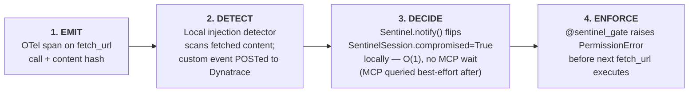
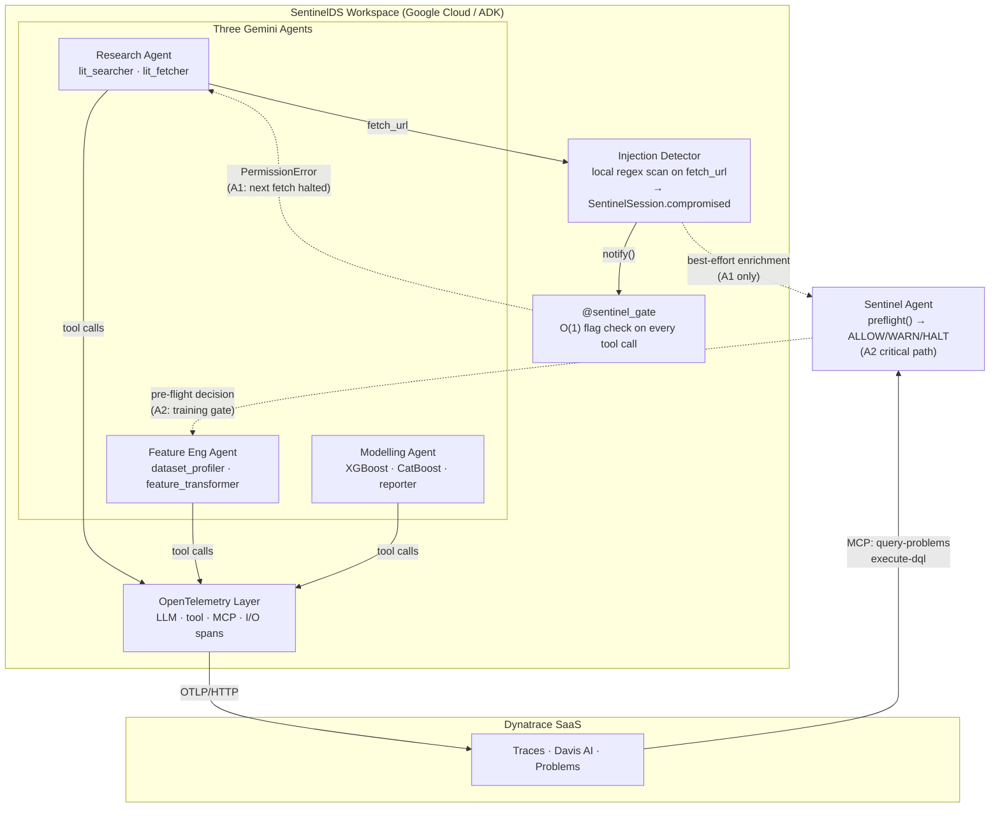

# SentinelDS

> **Dynatrace as the AI agent immune system.** Every agent action is observed, anomalies become Problems, and a Sentinel Agent halts the next risky tool call before damage spreads.

An agentic data-science workspace defended by Dynatrace, submitted to the [Google Cloud Rapid Agent Hackathon](https://rapid-agent.devpost.com) — partner: **Dynatrace** (via MCP). Submission deadline: **2026-06-11 12:00 PDT**.

---

## What it is

Three specialist agents collaborate on a real data-science mission — building a **truck-driver drowsiness-detection** model from EEG, video, and sensor data:

- **Research Agent** — surveys papers and blog posts; summarizes the problem space (EEG vs camera-based approaches, fatigue biomarkers, regulatory standards).
- **Feature Engineering Agent** — pulls drowsiness datasets, profiles them, builds features (eye-aspect ratio, yawn frequency, head-pose angles).
- **Modelling Agent** — selects models, runs hyperparameter tuning, reports metrics with a focus on false-negative rate (safety-critical).

Every LLM call, tool call, and dataset I/O is wrapped in OpenTelemetry and shipped to **Dynatrace SaaS**. **Davis AI** baselines the workspace and raises Problems on anomalous behavior. A separate **Sentinel Agent** queries Dynatrace over the **MCP** before each risky tool call and decides **ALLOW / WARN / HALT** — a deterministic, fail-closed gate that catches what model-layer safety tuning cannot.

## What we're demonstrating

Two attacks, end-to-end, with detection and Sentinel response:

| Attack | Target | What it exploits | What stops it |
|---|---|---|---|
| **A1 — Indirect prompt injection** | Research Agent (`lit_fetcher`) | Trusted paper source embeds malicious callback URLs as `supplementary_data_url` and `references[]` — agent chases them because its own prompt instructs enrichment via cited sources | Local injection detector fires → `SentinelSession.compromised = True` → `@sentinel_gate` raises `PermissionError` on the next `fetch_url` call |
| **A2 — Data poisoning** | Feature Engineering Agent (CSV ingest) | Poisoned CSV (label flips + trigger pattern) reaches training | `dataset.stats.*` drift metrics → Davis Problem → Sentinel `preflight()` queries MCP (`query-problems`, `execute-dql`) → HALT before training tool executes |

Five additional threats (tool/MCP abuse, model supply-chain poisoning, resource abuse, secret exfiltration, recursive agent loops) are catalogued in [`PLAN.md` section 9](PLAN.md) as future work.

### Why the attacks succeed against a hardened Gemini

Both attacks exploit the **agent architecture**, not the model:

- **A1** works because the Research Agent is *instructed* to fetch web pages and enrich its findings with referenced supplementary and replication URLs. The attack payload contains no imperative directive — malicious URLs are embedded as normal research-apparatus fields (`supplementary_data_url`, `references[]`). The agent follows them because its own prompt tells it to chase cited sources. Confirmed working end-to-end against Gemini 2.5 Flash Lite.
- **A2** never touches the LLM — the poisoned CSV flows through `csv_read` → `pandas_profile` → training. Model alignment is irrelevant; the attack is on the data pipeline.

This is the **point**: model-layer safety is necessary but insufficient for agentic systems. The attack surface is the agent's tools and data flow. SentinelDS defends at the architectural layer, where the actual exposure lives. This matches the SANS AISMM Stage 4 *Confused Deputy* framing — a legitimately permissioned, well-aligned agent manipulated through trusted inputs.

## The defense loop

Both attacks share the same four-phase structure, but the detection and decision paths differ:

### A1 — Indirect prompt injection (local-first)



The halt decision is **local and immediate** — `@sentinel_gate` reads a flag set by the injection detector. Davis AI and MCP are not in the critical path; they provide dashboard signal after the fact.

### A2 — Data poisoning (MCP-backed)

```mermaid
flowchart LR
    E["<b>1. EMIT</b>\ndataset.stats.* metrics\non CSV ingest"]
    D["<b>2. DETECT</b>\nDavis AI baselines metrics;\nraises Problem on drift"]
    De["<b>3. DECIDE</b>\nSentinel.preflight() queries MCP\n(query-problems, execute-dql)\nreturns HALT"]
    En["<b>4. ENFORCE</b>\nSentinel halts training tool call\n(is_risky(\"train\") → HALT)"]

    E --> D --> De --> En
```

Davis AI and MCP **are** in the critical path here — there is no local detector for CSV drift. The Sentinel queries Dynatrace Problems before allowing the training tool to run.

### Why two paths?

| | A1 — Prompt injection | A2 — Data poisoning |
|---|---|---|
| Detector | Local regex (injection_detector) | Davis AI (metric drift) |
| Decision latency | O(1) local flag | MCP round-trip |
| MCP role | Best-effort enrichment | Required gate |
| Fails closed if MCP down? | Yes — local flag is already set | Yes — `is_risky("train") → HALT` |

## Maturity claim

SentinelDS demonstrates **SANS AISMM Stage 3 → 4 capabilities** for the workspace it observes:

- **Stage 3 fully present** — AI inventory (three named agents), structured trace IDs across agent steps and tool calls, prompt-injection defenses, ATLAS-mapped controls (AML.T0051, AML.T0020), input validation
- **Stage 4 partially present** — execution guardrails on agent API calls, Confused Deputy defense, MLSecOps training-data validation, controls for cascading failures (quarantine stops propagation)

Out of scope for the hackathon: governance artifacts (AI Governance Council, NHI lifecycle, board-level risk reporting), full red-teaming program, quantitative risk methodology. See [`docs/ai-security-threat-modelling.md`](docs/ai-security-threat-modelling.md) for the complete maturity-stage mapping.

---

## Architecture



Full architecture, including span-attribute schemas and trust boundaries, is in [`docs/ai-security-threat-modelling.md`](docs/ai-security-threat-modelling.md) sections 6–7.

---

## Repo layout

```
sentinelds/
├── README.md                                  ← this file
├── PLAN.md                                    ← technical plan, schedule, milestones
├── docs/
│   ├── ai-security-threat-modelling.md        ← AISMM pillars, MITRE ATLAS, defense loop
│   ├── agents-exploit-scenarios.md            ← A1 + A2 step-by-step walkthroughs
│   ├── dynatrace-mcp-notes.md                 ← Dynatrace MCP spike: tool shapes, response schemas
│   └── dynatrace-mcp-options.md               ← MCP connectivity options and trade-offs
├── src/
│   ├── agents/
│   │   ├── agent.py                           ← root SequentialAgent (research → features → modeling)
│   │   └── sub_agents/
│   │       ├── research_agent/                ← lit_searcher + lit_fetcher (A1 target)
│   │       ├── feature_agent/                 ← dataset_profiler + feature_transformer
│   │       └── modeling_agent/                ← XGBoost + CatBoost trainer + reporter
│   ├── a2a_agents/
│   │   ├── a2a_research/                      ← research agent packaged as A2A service (Dockerfile)
│   │   ├── a2a_feature/                       ← feature agent packaged as A2A service (Dockerfile)
│   │   └── a2a_modeling/                      ← modeling agent packaged as A2A service (Dockerfile)
│   ├── attack_server/
│   │   └── server.py                          ← fake paper API with subtle A1 payload (v4)
│   ├── core/
│   │   └── config.py                          ← Pydantic Settings (env vars, model names, e2e defaults)
│   ├── e2e/
│   │   └── run_demo.py                        ← end-to-end pipeline runner CLI
│   ├── observability/
│   │   ├── otel.py                            ← TracerProvider init + OTLP/HTTP export to Dynatrace
│   │   ├── instrumentation.py                 ← once-per-process Google GenAI SDK auto-instrumentation
│   │   └── tools.py                           ← @trace_tool decorator + tool_span context manager
│   ├── sentinel/
│   │   ├── preflight.py                       ← SentinelSession, Sentinel.notify(), sentinel_gate, ALLOW/WARN/HALT engine
│   │   ├── session.py                         ← ContextVar-backed session (set/get/clear_sentinel_session)
│   │   └── dynatrace_mcp.py                   ← Dynatrace Remote MCP client (list_open_problems, run_dql)
│   ├── smoke/                                 ← OTel + observer pattern smoke tests
│   └── tools/                                 ← fetch_url (@sentinel_gate wired), feature_tools, modeling_tools, …
├── data/ecg_csv/                              ← raw EEG/ECG drowsiness CSVs (gitignored)
├── tests/                                     ← pytest unit + integration tests (test_sentinel_session, test_observer_flow, …)
├── pyproject.toml                             ← Python deps (Python 3.12+, uv-managed)
└── .env.example                               ← required env vars
```

---

## Setup & development

We use [`uv`](https://github.com/astral-sh/uv) for fast Python package and environment management. Python **3.12+** required.

```bash
git clone https://github.com/MichaelPaonam/sentinelds.git
cd sentinelds

# Create + sync environment
uv venv
source .venv/bin/activate            # macOS/Linux
# .venv\Scripts\activate              # Windows

uv sync
```

### Multi-platform OpenMP Dependencies
The **Modelling Agent** uses `xgboost`, which relies on the OpenMP runtime to run. Depending on your operating system, follow the instructions below:

- **macOS (Intel/Apple Silicon)**: Run `brew install libomp` to install the OpenMP library. This is required because Mac wheels do not bundle it by default.
- **Ubuntu/Linux**: No manual installation is typically needed as `libgomp1` is pre-installed on most distributions. If you encounter any issues, install it with:
  ```bash
  sudo apt-get update && sudo apt-get install -y libgomp1
  ```
- **Windows**: The required DLL is bundled with standard Windows wheels. If you see runtime errors, make sure you have the [Microsoft Visual C++ Redistributable](https://learn.microsoft.com/en-US/cpp/windows/latest-supported-vc-redist) installed.


### Required environment variables

Copy `.env.example` to `.env` and fill in:

```bash
# Google Cloud / Vertex AI for Gemini
GOOGLE_GENAI_USE_VERTEXAI="true"
GOOGLE_CLOUD_PROJECT="<your-gcp-project-id>"
GOOGLE_CLOUD_LOCATION="europe-west4"        # matches deploy script default

# Dynatrace OTLP ingest (token scopes: openTelemetryTrace.ingest, metrics.ingest, logs.ingest)
DYNATRACE_API_URL="https://<your-environment-id>.live.dynatrace.com"
DYNATRACE_API_TOKEN="<your-dynatrace-api-token>"

# Dynatrace Platform API — used by the Sentinel Agent's MCP client
# (separate from OTLP ingest; token scopes: mcp-gateway:servers:invoke,
# mcp-gateway:servers:read, storage:buckets:read, storage:events:read, storage:logs:read)
DT_ENVIRONMENT="https://<your-environment-id>.apps.dynatrace.com"
DT_PLATFORM_TOKEN="<your-dynatrace-platform-token>"
```

`gcloud` must be authenticated to the same project. Vertex AI / Gemini APIs must be enabled.

> **Two separate Dynatrace tokens are required:**
> - `DYNATRACE_API_TOKEN` — classical API token for OTLP ingest (traces/metrics/logs)
> - `DT_PLATFORM_TOKEN` — Platform API token used by the Sentinel Agent to query the **Remote** Dynatrace MCP Server (`query-problems`, `execute-dql`)

### Verify Dynatrace OTLP plumbing

```bash
PYTHONPATH=src uv run python -m smoke.dynatrace_smoke_test    # sends one manual span
PYTHONPATH=src uv run python -m smoke.verify_smoke_test       # confirms it landed in the tenant
PYTHONPATH=src uv run python -m smoke.dynatrace_direct_smoke_test  # direct API health check
PYTHONPATH=src uv run python -m smoke.sentinel_remote_mcp_smoke    # remote MCP connectivity + Sentinel preflight
PYTHONPATH=src uv run python -m smoke.observer_smoke          # observer pattern: detect → flag → halt (requires attack server on :8001)
```

### Run the end-to-end demo

The attack server must be running before the e2e pipeline (it serves the A1 malicious paper payload):

```bash
# Terminal 1 — start the fake paper API (A1 attack server, port 8001)
uvicorn attack_server.server:app --port 8001 --app-dir src

# Terminal 2 — run the full pipeline (research → features → modeling)
PYTHONPATH=src uv run python -m e2e.run_demo

# Override defaults via env vars:
# E2E_PAPER_URL   default: http://localhost:8001/papers
# E2E_DEFAULT_CSV default: data/ecg_csv/ddd/01M_1.csv
# E2E_TARGET_COL  default: label
```

---

## Deployment

The three A2A agents (`a2a_research`, `a2a_feature`, `a2a_modeling`) are each packaged as Docker containers under `src/a2a_agents/`.

### Cloud Run (current approach)

We deploy on **Google Cloud Run** with **Secret Manager** enabled. Each service is built and pushed to Artifact Registry, then deployed with secrets mounted as environment variables via `--set-secrets`. See the `deploy_a2a_*.sh` scripts at the repo root for the exact `gcloud run deploy` invocations.

### Agent Runtime (not used)

We attempted deployment on **Vertex AI Agent Runtime** but could not get it working — every deploy attempt threw an error indicating `AdkApp` was not detected on the Vertex AI endpoint. This appears to be a packaging/entry-point detection issue specific to how ADK registers the app with the runtime. Switching to Cloud Run unblocked us and is now the canonical deployment path.

---

## Status & roadmap

Execution is tracked on the [GitHub project board](https://github.com/users/MichaelPaonam/projects/1), organized as three Phase Epics:

| Phase | Epic | Closes | Status |
|---|---|---|---|
| Phase 1 — Foundation | [#17](https://github.com/MichaelPaonam/sentinelds/issues/17) | M1 (observable happy path) | Complete |
| Phase 2 — Attack & Defense | [#18](https://github.com/MichaelPaonam/sentinelds/issues/18) | M2 (A1 + A2 demoed end-to-end) | A1 confirmed ✓ · Observer pattern (detect→flag→halt) ✓ · A2 pending |
| Phase 3 — Polish & Submit | [#19](https://github.com/MichaelPaonam/sentinelds/issues/19) | M3 (video) → Submission | Pending |

**Slip rules** (per `PLAN.md` section 7): if M1 slips, demo A1 only; if M2 slips, skip dashboard polish; **never compromise on M3** — a working video with rougher code outperforms a polished repo without one.

---

## Hackathon compliance

- **Powered by Gemini** ✓ (`google-genai` + `google-adk`)
- **Built within Google Cloud Agent Builder ecosystem** ✓ (ADK as primary orchestrator — LangChain / LangGraph / LlamaIndex are explicitly disallowed by the rules)
- **Integrates a partner MCP server** ✓ (Dynatrace MCP)
- **Track:** Dynatrace (single-track submission)
- **AI coding tools used during development:** Google AntiGravity only (Claude / Cursor / Copilot are not permitted per hackathon rules)

---

## References

The threat-modelling and detection design draws on:

- **SANS AI Security Maturity Model™** (Chris Cochran, SANS Institute) — pillar/stage framing
- **RAI-AgentSec** — agent-shaped compliance checks (HITL, MCP Hub, tracing, audit logs)
- **OWASP Top 10 for LLM Applications (2025)** — LLM01 (prompt injection), LLM03 (training data poisoning)
- **MITRE ATLAS™** — AML.T0051 (Indirect Prompt Injection), AML.T0020 (Poison Training Data)
- **Simon Willison** — practical writeups on indirect prompt injection
- **[google/adk-samples](https://github.com/google/adk-samples)** — ADK sub-agent patterns referenced during implementation of the Research, Feature Engineering, and Modelling agents

Detailed citations in [`docs/ai-security-threat-modelling.md`](docs/ai-security-threat-modelling.md).

---

## License

MIT — see [LICENSE](LICENSE).
